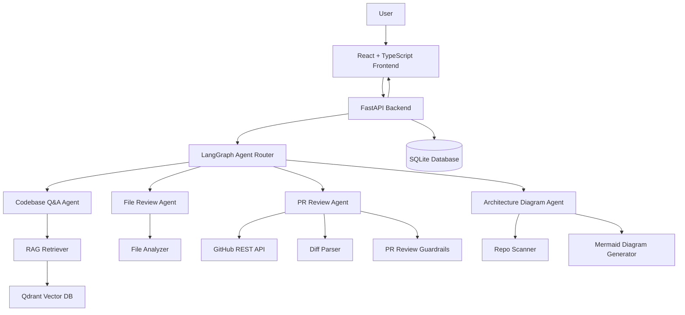
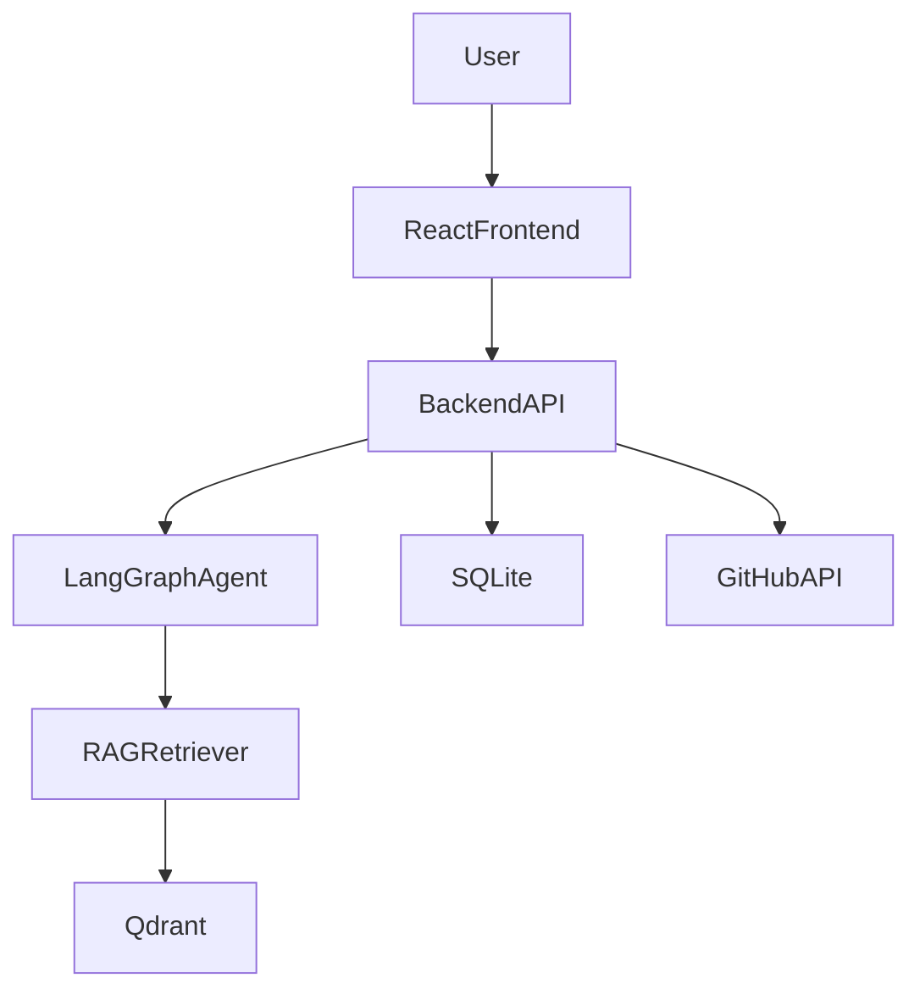

# RepoMind AI

**RepoMind AI** is an agentic AI-powered GitHub codebase assistant that helps developers understand repositories, ask codebase-related questions, review files, analyze pull requests, and generate architecture diagrams.

It uses **RAG**, **LangGraph**, **LangChain**, **Qdrant**, **FastAPI**, and **React** to provide grounded answers from the actual repository code.

---

## Features

### 1. GitHub Repository Import

Users can import a GitHub repository using its URL. RepoMind clones the repository, scans supported files, and prepares the codebase for indexing.

Supported files include:

* `.py`
* `.js`
* `.jsx`
* `.ts`
* `.tsx`
* `.json`
* `.md`
* `.html`
* `.css`

Ignored folders/files:

* `.git`
* `node_modules`
* `venv`
* `.venv`
* `dist`
* `build`
* `coverage`
* `__pycache__`
* `.env`
* binary files
* images/videos

---

### 2. Codebase Q&A using RAG

Users can ask questions about the imported codebase.

Example questions:

```text
Where is authentication handled?
Explain the backend API flow.
Which file connects to the database?
How does login work?
```

The assistant retrieves relevant code chunks from **Qdrant** and answers with file-level references.

---

### 3. File-Level Code Review

Users can select a file and ask RepoMind to review it.

The review checks for:

* logic bugs
* missing validation
* bad error handling
* security risks
* performance issues
* code quality problems

---

### 4. GitHub PR Review Bot

RepoMind can review GitHub pull requests before merge.

When a user asks:

```text
Review PR #12
```

The agent fetches the pull request diff, retrieves related code context, and checks for:

* logic bugs
* runtime errors
* breaking changes
* frontend/backend mismatch
* missing validation
* weak authentication
* security risks
* database mismatch
* performance issues
* edge cases after merge

The PR Review Bot returns:

* PR status
* risk score from 0 to 10
* summary
* issues found
* impact after merge
* suggested fixes
* final recommendation

---

### 5. PR Review Guardrails

The PR review output is validated before being shown to the user.

Guardrails check that:

* issue files exist in the repo
* issue files are changed or related to the PR
* line numbers are valid
* risk score is between 0 and 10
* severity is valid: Low, Medium, or High
* every issue includes evidence
* secrets are redacted
* fake file references are removed

If a secret is detected, RepoMind replaces it with:

```text
[REDACTED_SECRET]
```

---

### 6. Architecture Diagram Generator

RepoMind can generate a Mermaid.js architecture diagram from the repository.

It analyzes:

* folder structure
* frontend/backend separation
* API routes
* controllers
* services
* database models
* auth middleware
* external APIs
* imports and dependencies

The generated diagram includes a confidence score and a note that the diagram is AI-assisted and may need manual verification.

---

### 7. Streaming Chat UI

The frontend displays AI responses in real time using Server-Sent Events.

---

## Tech Stack

### Frontend

* React.js
* TypeScript
* Vite
* Tailwind CSS
* Monaco Editor
* Monaco Diff Editor
* Mermaid.js

### Backend

* Python
* FastAPI
* LangGraph
* LangChain
* Qdrant
* SQLite
* GitPython
* GitHub REST API
* Server-Sent Events

### AI / RAG

* LangGraph for agent orchestration
* LangChain for RAG utilities
* Qdrant for vector search
* Gemini Flash or GPT-4o-mini for LLM
* Gemini embeddings or OpenAI `text-embedding-3-small`

---

## System Architecture



---

## Project Structure

```text
repomind-ai/
├── backend/
│   ├── main.py
│   ├── config.py
│   ├── requirements.txt
│   ├── db/
│   │   ├── models.py
│   │   ├── session.py
│   │   └── crud.py
│   ├── graph/
│   │   ├── state.py
│   │   ├── graph.py
│   │   └── nodes/
│   │       ├── input_guardrails.py
│   │       ├── classifier.py
│   │       ├── qa_agent.py
│   │       ├── file_review_agent.py
│   │       ├── pr_review_agent.py
│   │       ├── pr_guardrails.py
│   │       ├── review_formatter.py
│   │       ├── architecture_agent.py
│   │       └── output_guardrails.py
│   ├── rag/
│   │   ├── chunker.py
│   │   ├── embeddings.py
│   │   ├── vectorstore.py
│   │   ├── indexer.py
│   │   └── retriever.py
│   ├── github/
│   │   ├── clone_repo.py
│   │   ├── github_client.py
│   │   ├── pr_fetcher.py
│   │   └── diff_parser.py
│   └── tools/
│       ├── repo_scanner.py
│       ├── code_analyzer.py
│       ├── diagram_generator.py
│       ├── mermaid_validator.py
│       └── secret_scanner.py
│
├── frontend/
│   ├── package.json
│   ├── vite.config.ts
│   └── src/
│       ├── App.tsx
│       ├── api/
│       │   ├── repoApi.ts
│       │   ├── chatApi.ts
│       │   ├── prApi.ts
│       │   └── architectureApi.ts
│       ├── pages/
│       │   ├── Dashboard.tsx
│       │   ├── RepoChat.tsx
│       │   ├── PRReview.tsx
│       │   └── Architecture.tsx
│       └── components/
│           ├── ChatWindow.tsx
│           ├── FileTree.tsx
│           ├── CodeViewer.tsx
│           ├── DiffViewer.tsx
│           ├── ReviewPanel.tsx
│           └── MermaidViewer.tsx
│
├── docker-compose.yml
├── README.md
└── .env.example
```

---

## Environment Variables

Create a `.env` file inside the backend folder.

```env
OPENAI_API_KEY=
GEMINI_API_KEY=
GITHUB_TOKEN=

DATABASE_URL=sqlite:///./repomind.db

QDRANT_URL=http://localhost:6333
QDRANT_API_KEY=
QDRANT_COLLECTION_PREFIX=repo

REPOS_DIR=./repos
BACKEND_URL=http://localhost:8000
FRONTEND_URL=http://localhost:5173
```

---

## Installation

### 1. Clone the repository

```bash
git clone https://github.com/your-username/RepoMind.git
cd RepoMind
```

---

### 2. Start Qdrant

Using Docker:

```bash
docker run -p 6333:6333 qdrant/qdrant
```

Or using Docker Compose:

```bash
docker-compose up qdrant
```

---

### 3. Backend Setup

```bash
cd backend
python -m venv venv
```

Activate virtual environment:

For Windows:

```bash
venv\Scripts\activate
```

For Linux/Mac:

```bash
source venv/bin/activate
```

Install dependencies:

```bash
pip install -r requirements.txt
```

Run backend:

```bash
uvicorn main:app --reload
```

Backend runs on:

```text
http://localhost:8000
```

Health check:

```text
GET http://localhost:8000/health
```

---

### 4. Frontend Setup

```bash
cd frontend
npm install
npm run dev
```

Frontend runs on:

```text
http://localhost:5173
```

---

## API Routes

### Repository APIs

```text
POST /repos/import
GET  /repos
GET  /repos/{repo_id}
POST /repos/{repo_id}/index
POST /repos/{repo_id}/search
```

### Chat API

```text
POST /chat/stream
```

### File Review API

```text
POST /repos/{repo_id}/file-review
```

### Pull Request Review APIs

```text
GET  /repos/{repo_id}/pulls
POST /repos/{repo_id}/pulls/{pr_number}/review
```

### Architecture APIs

```text
POST /repos/{repo_id}/architecture/generate
GET  /repos/{repo_id}/architecture
```

---

## Example PR Review Output

```text
PR Review Result

Status: Needs changes
Risk Score: 7/10

Summary:
This PR modifies authentication middleware and login response handling.

Issues Found:

1. Missing return after error response
File: backend/middleware/auth.js
Line: 18
Severity: High

Evidence:
The middleware sends a 401 response when the token is missing but does not stop execution.

Problem:
The request may continue after sending the error response.

Impact:
This can cause duplicate responses or runtime errors after merge.

Suggested Fix:
Add return before res.status(401).json(...).

Final Recommendation:
Do not merge until the high-severity issue is fixed.
```

---

## Example Architecture Output

```text
Architecture Diagram

Confidence: 82%

Note:
This diagram is AI-assisted and based on static analysis, so it may need manual verification.
```



---

## Limitations

* Architecture diagrams are not guaranteed to be 100% correct.
* PR review depends on the quality of retrieved code context.
* Large repositories may take more time to index.
* Dynamic imports and runtime-generated routes may not be fully detected.
* MVP does not post inline comments to GitHub.
* MVP does not automatically generate or apply patches.
* MVP uses SQLite for simplicity.

---

## Future Improvements

* GitHub App integration with webhooks
* Inline GitHub PR comments
* PostgreSQL instead of SQLite
* Hybrid dense + sparse retrieval in Qdrant
* Dependency vulnerability scanner
* Patch generation with human approval
* Repo memory and session history
* Better code parsing using tree-sitter
* Multi-repo workspace support
* Role-based authentication

---

## Resume Description

```text
Built RepoMind AI, an agentic GitHub codebase assistant using LangGraph, LangChain, FastAPI, React, TypeScript, and Qdrant, enabling repository Q&A, file-level code review, guarded pull request analysis, and AI-assisted architecture diagram generation with code-grounded citations.
```

---

## License

This project is licensed under the MIT License.

---

## Author

**Pranjal Gupta**
